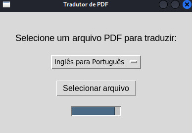
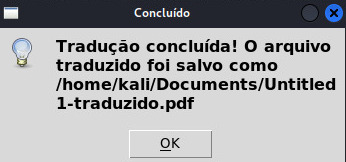

# Tradutor de PDF

Este é um aplicativo simples em Python que permite traduzir o texto contido em arquivos PDF entre os idiomas Português e Inglês, utilizando a biblioteca `googletrans` para tradução e `PyMuPDF` para extração de texto.

## Interface do Tradutor de PDF

Abaixo está uma captura de tela da interface gerada pelo aplicativo:



## Pré-requisitos

Antes de começar, você precisa ter os seguintes softwares instalados em sua máquina:

- [Python 3.x](https://www.python.org/downloads/)
- [pip](https://pip.pypa.io/en/stable/installation/) (geralmente já incluído com o Python)
- [PyMuPDF](https://pypi.org/project/PyMuPDF/) (para extrair texto de arquivos PDF)
- [googletrans](https://pypi.org/project/googletrans/) (para realizar traduções)
- [fpdf](https://pypi.org/project/fpdf/) (para criar arquivos PDF)
- [tqdm](https://pypi.org/project/tqdm/) (para exibir uma barra de progresso)
- [tkinter](https://wiki.python.org/moin/TkInter) (para a interface gráfica, já incluído com o Python)

## Fork do Repositório

Para trabalhar neste projeto, siga os passos abaixo:

### 1. Criar um Fork do Repositório

1. Acesse o repositório no GitHub.

2. Clique no botão **Fork** no canto superior direito da página.

### 2. Clonar o Repositório Forkado

#### No Windows

1. Abra o **Prompt de Comando** ou o **PowerShell**.

2. Navegue até o diretório onde deseja clonar o repositório:

   ```bash
   cd caminho\para\seu\diretorio
   ```
3. Execute o comando para  clonar o repositório:

    ```bash
    git clone https://github.com/SEU_USUÁRIO/NOME_DO_REPOSITORIO.git
    ```

#### No Linux

1. Abra o **Terminal**.

2.  Navegue até o diretório onde deseja clonar o repositório:

    ```bash
    cd caminho/para/seu/diretorio
    ```
3.  Execute o comando para clonar o repositório:

    ```bash
    git clone https://github.com/SEU_USUÁRIO/NOME_DO_REPOSITORIO.git
    ```
### 3. Crie um Ambiente Virtual

1. Navegue até o repositório clonado:

    ```bash
    cd NOME_DO_REPOSITORIO
    ```
2. Crie o ambiente virtual:

    ```bash
    python -m venv ambiente_virtual
    ```
3.  Ative o ambiente virtual:

    #### No Windows

    ```bash
    ambiente_virtual\Scripts\activate
    ```
    #### No Linux

    ```bash
    source ambiente_virtual/bin/activate
    ```

### 4. Instalar Dependências

1. Com o ambiente virtual ativado, instale as dependências do projeto:

    ```bash
    pip install -r requirements.txt
    ```

### 5. Executar o Projeto

1. Certifique-se de estar no diretório do projeto:

    ```bash
    cd NOME_DO_REPOSITORIO
    ```
2.  Execute o projeto:

    ```bash
    python tradutor.py
    ```

### 6. Usando o Tradutor de PDF

1. Ao abrir o aplicativo, você verá uma interface simples.

2. Selecione se vai traduzir do português  para inglês ou vice-versa.

3. Clique em **Selecionar arquivo** para escolher um arquivo PDF que deseja traduzir.

4. A tradução será processada, e uma barra de progresso será exibida.

5. Após a conclusão, um novo arquivo PDF será gerado com o texto traduzido, conforme mostra na figura abaixo:

<br>

